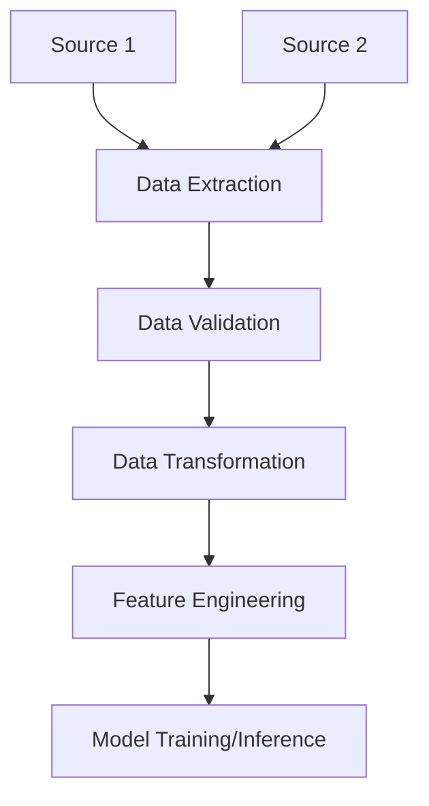
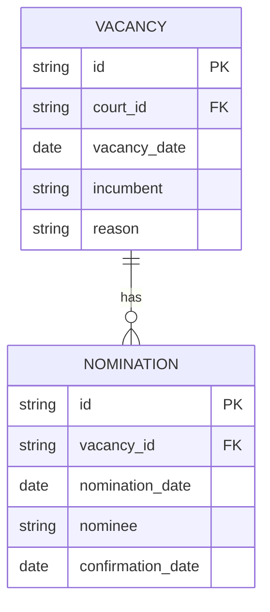

# Judicial Vacancy Predictor - Design Planning

*Document Version: 1.0*  
*Last Updated: 2025-07-02*  

## Table of Contents

- [1. Project Overview](#1-project-overview)
- [2. Data Pipeline](#2-data-pipeline)
- [3. Data Model](#3-data-model)
- [4. Feature Engineering](#4-feature-engineering)
- [5. Model Development](#5-model-development)
- [6. Testing Strategy](#6-testing-strategy)
- [7. Error Handling & Logging](#7-error-handling--logging)
- [8. Security & Compliance](#8-security--compliance)
- [9. Deployment](#9-deployment)
- [10. Monitoring & Maintenance](#10-monitoring--maintenance)
- [11. Documentation](#11-documentation)
- [12. Future Enhancements](#12-future-enhancements)

## 1. Project Overview

### 1.1 Purpose

This document serves as a git-trackable supplement to the IDE code assist LLM's `plan.md` to understand the intent of the project being worked on, and guide design & implementation.

### 1.2 Scope

- [ ] In scope - see this plan, `readme.md`, `plan.md` (if applicable), and files' docstrings.
- [ ] Out of scope - anything which could delay project presentation by prescribed deadline (e.g. taking on more datasources before pipeline to process initial set appears stable)
- [ ] Assumptions - originating data sources are accurate, and quantity of data obtainable from them is sufficient to attempt model training and evaluation.
- [ ] Constraints - presentations for project to be rehearsed July 16th, 2025, therefore project effectively due that morning or earlier.

## 2. Data Pipeline

### 2.1 Data Sources

| Source | Format | Frequency | Access Method | Notes |
|--------|--------|-----------|---------------|-------|

| <https://www.uscourts.gov/data-news/judicial-vacancies/archive-judicial-vacancies?year=2025> (and similarly-named pages for years 1981-2024)
 | year-level HTMLs which link to month-level HTMLs and/or to month-level PDFs | Monthly | Web Scraping | Primary source of vacancy data |
| (N/A) | (N/A) | (N/A) | (N/A) | [No additional sources to be scraped as of typing this] |

### 2.2 Data Flow

### 2.3 Pipeline Components

1. **Extraction**
   - [ ] Web Scraper
   - [ ] HTML parsing
   - [ ] PDF parsing

2. **Transformation**
   - [ ] Data Cleaning
   - [ ] Normalization
   - [ ] Enrichment

3. **Loading**
   - [ ] CSV Storage
   - [ ] Trained model file Export
   - [ ] Inference using trained model

## 3. Data Model

### 3.1 Entity Relationship Diagram

### 3.2 Data Dictionary

see `references/data_dictionary.md`

## 4. Feature Engineering

### 4.1 Feature List

see `references/data_dictionary.md`, which also serves to specify features which are calculated instead of innately-supplied with raw data.

### 4.2 Feature Groups

1. **Temporal Features**
   - [ ] Days since vacancy
   - [ ] Days since nomination
   - [ ] Days until confirmation

2. **Court-specific Features**
   - [ ] Court type
   - [ ] Geographic region
   - [ ] Historical nomination patterns

## 5. Model Development

### 5.1 Model Selection

- [ ] Model Type: Regression (survivability analysis of vacancies, i.e. predicting # of days until nomination and/or # of days until confirmation)
- [ ] Algorithms to Evaluate:
  - [ ] Linear Regression
  - [ ] Random Forest
  - [ ] XGBoost
  - [ ] Neural Network

### 5.2 Training Process

1. **Data Splitting**
   - Train/Test: 80/20 training/test
   - Time-based split (e.g. 2010-2019 for training, 2020-2021 for validation, 2022-2024 for test) has been decided as NOT usable, because we are trying to discover whether/how there are changes / trends over time, which would be confounded by that kind of split.

2. **Evaluation Metrics**
   - Primary: [e.g., RMSE, Accuracy]
   - Secondary: [e.g., MAE, F1]

## 6. Testing Strategy

### 6.1 Test Types

| Test Type | Tools | Coverage Target |
|-----------|-------|-----------------|
| Unit Tests | pytest | 90% |
| Integration | pytest | 80% |
| E2E | Selenium | 70% |

### 6.2 Test Data Management

- [ ] Raw data storable in data/raw folder
- [ ] Fixture Management - fixture-downloading file bulk-downloads unprocessed snapshot of live pages to store in tests/fixtures/pages folder(s)
- [ ] Test Data Refresh Policy - non-automated, triggerable on-demand; website pages are allegedly updated monthly but update schedule or reliability unknown

## 7. Error Handling & Logging

### 7.1 Error Categories

1. **Data Quality Issues**
   - Missing values -- TBD
   - Invalid formats -- TBD
   - Outliers -- TBD

2. **System Errors**
   - Connection failures -- web-scraping retries allowed
   - Timeouts -- web-scraping timeout after 10 seconds, throwing error and/or warning
   - Resource constraints -- likely too many pages to "toss them over the wall" to something like OpenAI to parse the HTML or pages for us, both in terms of cost, processing time, or consistency/reliability; we'll try parsing pages ourselves locally.

### 7.2 Logging Strategy

- **Levels**: DEBUG, INFO, WARNING, ERROR, CRITICAL
- **Retention**: N/A
- **Monitoring**: N/A

## 8. Security & Compliance

### 8.1 Data Protection

- [ ] Encryption at rest - not required, data is public information
- [ ] Encryption in transit - not required, data is public information
- [ ] Access controls - not required, data and webapp are intended as public information utility

### 8.2 Compliance Requirements

- [ ] GDPR - N/A, US-based
- [ ] CCPA - N/A, user data not stored
- [ ] Industry-specific regulations - N/A, government-related rather than commercial industry

## 9. Deployment

### 9.1 CI/CD Pipeline

1. **Continuous Integration**
   - Automated testing via pytest
   - Code quality checks via mypy
   - Security scanning not required

2. **Continuous Deployment**
   - Optionally may implement CI/CD pipeline after initial project presentation is delivered

## 10. Monitoring & Maintenance

### 10.1 Monitoring

- **Application Metrics**:
  - Response times (N/A, small-scale project)
  - Error rates (known issues / bugs allowable if documented, but must have error rate low enough to deliver satisfactory presentation demonstrating use)
  - Resource utilization (target platform on which to run model is <=8GB RAM and 2 CPU cores.)

- **Business Metrics**:
  - Prediction accuracy (primary metric)
  - Data freshness (N/A, data update frequency unknown and outside our control)
  - Usage statistics (N/A, small-scale project)

### 10.2 Maintenance

- [ ] Regular dependency updates - dependencies managed in pyproject.toml
- [ ] Database maintenance - N/A, database not involved (or if Streamlit requires one, won't know that until starting to implement Streamlit webapp)
- [ ] Performance optimization - N/A, small-scale project

## 11. Documentation

### 11.1 Technical Documentation

- [ ] API Documentation - N/A, no API planned
- [ ] Architecture Diagrams - see mermaid diagrams in this document
- [ ] Setup Guide - see README.md

### 11.2 User Guides

- [ ] Administrator Guide - see README.md
- [ ] End User Guide - see README.md
- [ ] API Reference - N/A, no API planned

## 12. Future Enhancements

### 12.1 Short-term

- [ ] Additional data sources - American Bar Association ratings
- [ ] Enhanced validation
- [ ] Performance improvements

### 12.2 Long-term

- [ ] Advanced analytics - LLM-based rather than deterministic data scraping to allow incorporating additional data sources
- [ ] Predictive modeling - deep learning model to discover more nonlinear relationships between features and target variable
- [ ] Automated reporting - N/A, not planned

---
*This is a living document. Please update it as the project evolves.*
